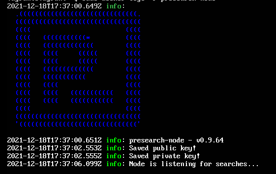

# ansible-for-presearch-node
Ansible playbook to setup presearch node on Ubuntu

# Features
This playbook will install a presearch node onto the target host(s) in **one simple command** matching the configuration found on the official [presearch website](https://docs.presearch.org/nodes/setup). Ansible allows for repeatable deployments and documentation of your deployments.

**Note** that you will need to acquire a registration code from presearch.org and stake PRE tokens to earn rewards as a node runner.

# Support
Did you find this playbook helpful?? Consider donating to allow for continued development efforts on this project:

* PRE address: [0xFd91fd23594eb434Be83e8480AA1cF6AD27dD1cF](https://metamask.app.link/send/0xFd91fd23594eb434Be83e8480AA1cF6AD27dD1cF)
* XRP address: rJHaS2aoKFngQayJP8qqtibRMMV8819oFL
* NANO/XNO address: nano_3mskjdt66bi96m3wdu1ynnqgx5inhjeoe3bhg3um3mwwxtfbiehzp5tcqww5

# Deployment
1. [Install ansible](https://docs.ansible.com/ansible/latest/installation_guide/intro_installation.html#installing-ansible-on-specific-operating-systems) on your laptop or workstation
2. Rename [example-hosts.ini](example-hosts.ini) to hosts.ini and edit to match your deployment
3. Add your REGISTRATION_CODE into `vars.yml`
4. Run this command to deploy your node: `ansible-playbook -i hosts playbook.yml`

### Testing
Currently, the playbook was tested with the use of Vagrant. Simply run:
`vagrant up`
and the playbook will execute once the vm has been provisioned.

After modifying the playbook further, run:
`vagrant provision` 
to rerun the playbook.

